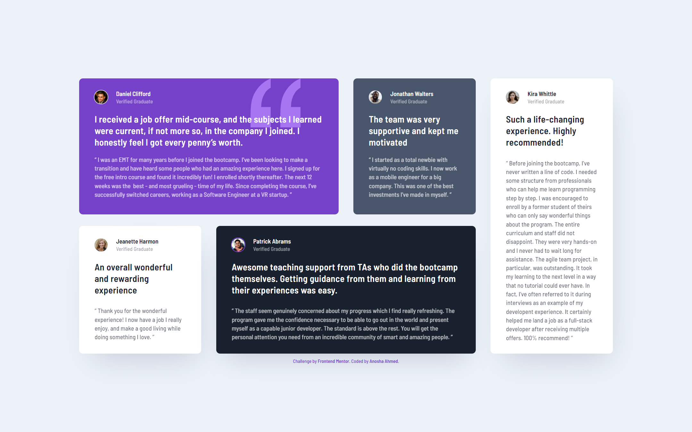

# Frontend Mentor - Testimonials grid section solution

This is a solution to the [Testimonials grid section challenge on Frontend Mentor](https://www.frontendmentor.io/challenges/testimonials-grid-section-Nnw6J7Un7).

## Table of contents

- [Overview](#overview)
  - [The challenge](#the-challenge)
  - [Screenshots](#screenshots)
  - [Links](#links)
- [My process](#my-process)
  - [Built with](#built-with)
  - [What I learned](#what-i-learned)
  - [Continued development](#continued-development)
  - [Useful resources](#useful-resources)
- [Author](#author)

## Overview

### The challenge

Users should be able to:

- View the optimal layout for the site depending on their device's screen size

### Screenshots

The desktop design VS My desktop solution 
 

 

The mobile design VS My mobile solution 
 

### Links

- Solution URL: [FrontEnd Mentor: My Solution](https://www.frontendmentor.io/solutions/testimonials-grid-section-flexbox-grid-mobilefirst-responsive-WVxZ0kX6-)
- Live Site URL: [GitHub Page: Testimonials Grid Section](https://anoshaahmed.github.io/fem10-testimonials-grid/)

## My process

### Built with

- Semantic HTML5 markup
- CSS custom properties
- Flexbox
- CSS Grid
- Mobile-first workflow

### What I learned

In this challenge, I gave everything in my HTML class, and I used only them as my CSS selectors, rather than heavily nesting my selectors.

### Continued development

In the future, I want to get better and quicker at designing my layout.

### Useful resources

- [w3schools: CSS Background Shorthand](https://www.w3schools.com/css/css_background_shorthand.asp) - This reminded me of the background shorthand property.
- [w3schools: CSS grid-area Property](https://www.w3schools.com/cssref/pr_grid-area.asp) - This helped remember the grid-area property.
- [CSS-TRICKS: CSS Box Shadow](https://css-tricks.com/snippets/css/css-box-shadow/) - This helped me understand the box-shadow property.
- [CSS Scan: Beautiful CSS box-shadow examples](https://getcssscan.com/css-box-shadow-examples) - This is an amazing article with 93 box-shadow examples.

## Author

- Website - [Anosha Ahmed](https://www.anoshaahmed.com) - Not up at the moment, but will be soon.
- Frontend Mentor - [@anoshaahmed](https://www.frontendmentor.io/profile/anoshaahmed)
- Twitter - [@anosha1ahmed](https://www.twitter.com/anosha1ahmed)
